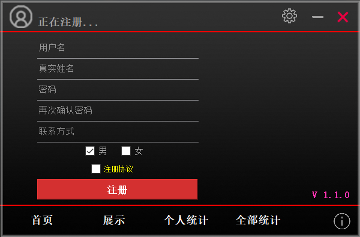
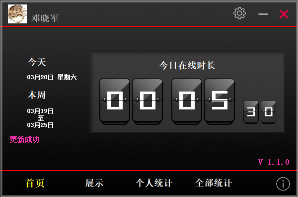
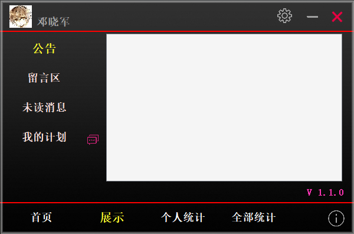
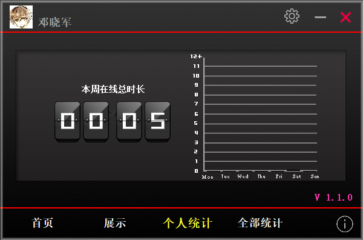
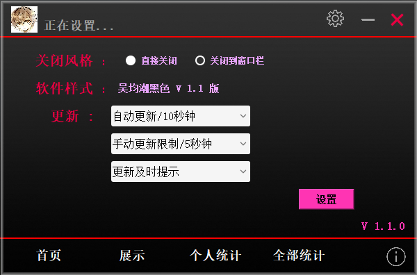

# 打卡计时器

#### 介绍
本项目为学习与研究项目，通过设计与实现一款桌面计时器软件，实现类似钉钉的考勤打卡功能，有助于提高学习效率。主要功能包括：登录注销、用户信息设置、自动识别 WIFI 网络、定时更新计时信息、公告展示、个人在线时长统计、每周计时排名统计等。

#### 截图

#### 技术栈
C++、Qt

1. 项目采用 C/S 架构，即客户端/服务器体系结构
2. GUI 界面采用基于 C++ 的 Qt 框架进行开发

#### 功能特性

1. 用户登录、注册、注销，其中登录的时候可以选择记住密码以及自动登录
2. 登录之后可到用户信息设置界面完善或修改用户信息，方便统计时长排名
3. 支持定时匹配 WIFI 的物理地址，如若不匹配，则自动停止打卡计时
4. 打卡计时信息首先会加密保存在本地数据文件，之后会定时同步更新服务器计时信息
5. 使用柱状图表的方式统计个人的本周在线时长，方便直观地显示每天的学习时间
6. 每一周都会统计所有人的计时排名，根据计时时长使用列表的形式降序排列
7. 打卡计时器只能在后台运行一个，即无法重复打开多个计时器，确保计时的准确性

#### 使用说明

1. document 文件夹保存了一些版本更新信息，其中 xgtimer.sql 为数据库备份文件
2. 可在 Headers/myserver.h 文件中修改服务器连接信息
3. 此项目为 Qt 项目，需配置 Qt 环境，并且使用 Qt Creator 才能正常运行
4. 如需打包发布，则应先在 Qt Creator 中构建 Release 版的 XGTimer.exe 可执行文件，然后使用 windeployqt XGTimer.exe 命令生成 Qt 依赖运行库
